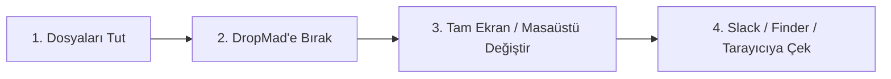

# 📖 DropMad - Complete User Guide & Documentation
# 📖 DropMad - Kapsamlı Kullanım Kılavuzu & Rehber

---

## 🌐 Language / Dil Seçimi
- [🇬🇧 English User Guide](#-english-user-guide)
- [🇹🇷 Türkçe Kullanım Kılavuzu](#-türkçe-kullanım-kılavuzu)

---

## 🇬🇧 English User Guide

Welcome to **DropMad**! This guide covers everything you need to know to get the most out of DropMad on macOS.

---

### 1. 🚀 Quick Start in 30 Seconds

1. **Open the Shelf:** Click the **DropMad icon in your top-right Menu Bar**. DropMad appears right on screen.
2. **Drop Files In:** Drag any file, folder, image, or link onto the shelf (or directly onto the menu bar icon).
3. **Move to Your Target App:** Switch to another desktop Space, full-screen browser, or app. DropMad stays floating on top!
4. **Drag Files Out:** Click and drag the file card out of DropMad directly into your target app (Slack, Mail, Discord, Finder, web upload area).

---

### 2. 🖱️ Controls & Actions

| Action | How to Trigger | Description |
|---|---|---|
| **Toggle Shelf** | Click Menu Bar Icon | Opens/closes DropMad instantly without permission hassles. |
| **Open File** | Double-Click on Card | Opens the file in its default macOS app. |
| **Reveal in Finder** | Right-Click Card → *Reveal in Finder* | Highlights the file in its actual folder. |
| **Drag Out to Target** | Click & Drag Card | Drops the file into any other application. |
| **Remove from Shelf** | Hover & Click `✕` or Right-Click → *Remove* | Clears the item from the shelf (does not delete original file). |
| **Language Switcher** | Right-Click Menu Bar Icon | Seamlessly switch between English 🇬🇧 and Türkçe 🇹🇷. |
| **User Guide** | Click `?` on Header | Opens the built-in illustrated guide. |

---

### 3. 🧰 Power Features

#### 🗜️ "Zip All" (Instant Multi-File Archiver)
- Have 5 different files on your shelf from 5 different folders?
- Click the **"Zip All"** button at the bottom of DropMad.
- DropMad compresses all files into a single `.zip` file in the background without freezing your UI, and places the zip right on your shelf ready to send!

#### 📋 "Copy All" (Instant Clipboard Export)
- Need to paste file paths or references into Terminal, TextEdit, or Notes?
- Click **"Copy All"** to copy all buffered file objects directly into your macOS clipboard.

---

 

 

## 🇹🇷 Türkçe Kullanım Kılavuzu

**DropMad**'e hoş geldiniz! Bu rehber, Mac'inizde DropMad'den en yüksek verimi almanız için gereken tüm detayları içerir.

---

### 1. 🚀 30 Saniyede Hızlı Başlangıç

1. **Rafı Açın:** Sağ üst **Menü Çubuğundaki DropMad simgesine** tıklayın. Raf anında ekranda belirir.
2. **Dosyaları Bırakın:** Finder'dan, masaüstünden veya tarayıcıdan herhangi bir dosyayı, klasörü veya resmi rafın üzerine sürükleyin.
3. **Hedef Uygulamaya Geçin:** Diğer masaüstü alanına (Space) veya tam ekran çalışan bir uygulamaya geçin. DropMad kaybolmaz, ekranda yüzer!
4. **Hedefe Sürükleyin:** Raftaki dosyayı tutup doğrudan Slack, Mail, WhatsApp, Finder veya web sitesi yükleme alanına bırakın.

---

### 2. 🖱️ Kullanım ve Kontroller

| Eylem | Nasıl Yapılır? | Açıklama |
|---|---|---|
| **Rafı Aç / Kapat** | Menü Çubuğu İkonuna Tıkla | İzin derdi olmadan rafı anında açar veya kapatır. |
| **Dosyayı Aç** | Karta Çift Tıklama | Dosyayı varsayılan macOS uygulamasında açar. |
| **Finder'da Göster** | Karta Sağ Tıkla → *Finder'da Göster* | Dosyanın bulunduğu asıl klasörü açıp dosyayı seçer. |
| **Hedefe Bırak (Drag-Out)** | Kartı Tut ve Sürükle | Dosyayı hedef uygulamaya taşır. |
| **Raftan Çıkar** | Üzerine Gelip `✕` veya Sağ Tık → *Kaldır* | Dosyayı raftan kaldırır (asıl dosyaya zarar vermez). |
| **Dil Seçimi** | Menü İkonuna Sağ Tıkla | Türkçe 🇹🇷 ve English 🇬🇧 arasında geçiş yapar. |
| **Kullanım Kılavuzu** | Başlıktaki `?` İkonuna Tıkla | Uygulama içi resimli rehberi açar. |

---

### 3. 🧰 Süper Güçler & İpuçları

#### 🗜️ "Hepsini Zip Yap" (Tek Tıkla Arşivleme)
- Farklı klasörlerden 5 farklı dosya mı topladınız?
- Alttaki **"Hepsini Zip Yap"** butonuna tıklayın.
- DropMad arka planda bilgisayarı dondurmadan dosyaları tek bir `.zip` dosyası haline getirir ve doğrudan rafa koyar!

#### 📋 "Hepsini Kopyala" (Pano Desteği)
- Terminal'e veya bir mesaja dosya yollarını mı yapıştıracaksınız?
- **"Hepsini Kopyala"** butonuna basarak tüm dosyaları panoya kopyalayabilirsiniz.

---

## 📄 Lisans
MIT Lisansı ile korunmaktadır. Özgürce kullanabilir, geliştirebilir ve paylaşabilirsiniz!
